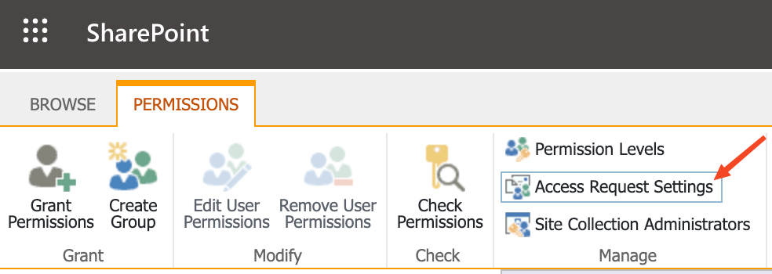
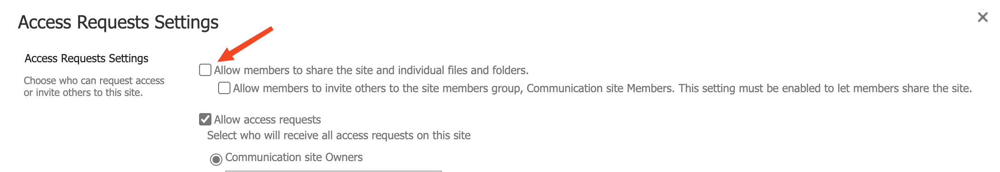

SharePoint Online is a powerful collaboration tool that allows users to share documents and collaborate with others. However, sometimes you may want to restrict sharing permissions for non-owners of a document. In this post, we'll show you how to disable sharing for non-owners in SharePoint Online.

## Steps to Disable Sharing for Non-Owners

1. Open the SharePoint Online site where you want to disable sharing for non-owners.
2. Click on the gear icon in the top right corner and select "Site Settings".
3. Under "Site Permissions", click on "Advanced permission settings".
4. In the ribbon choose the "Access Request Settings".

5. Uncheck "Allow members to share the site and individual files and folders" to restrict sharing permissions for non-owners of a document. 

That's it! Now you know how to disable sharing for non-owners in SharePoint Online. If you have any questions or comments, please leave them below.