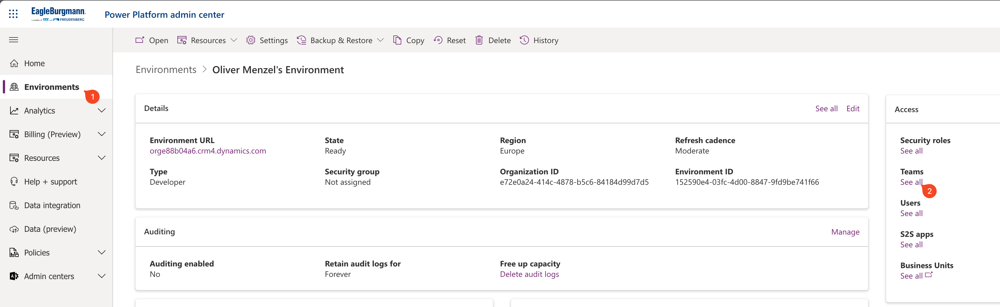
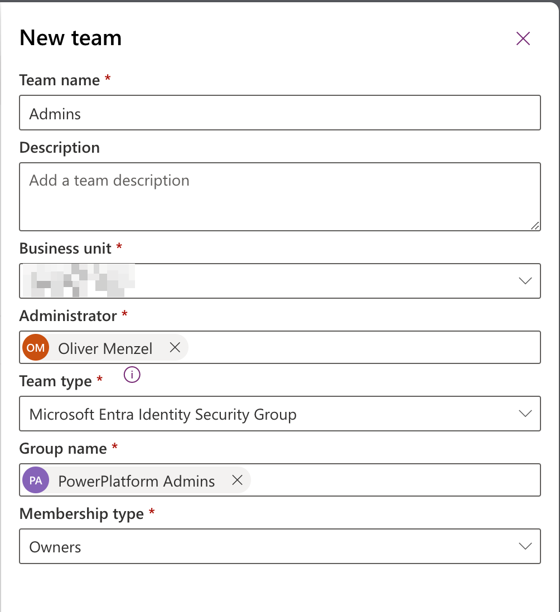
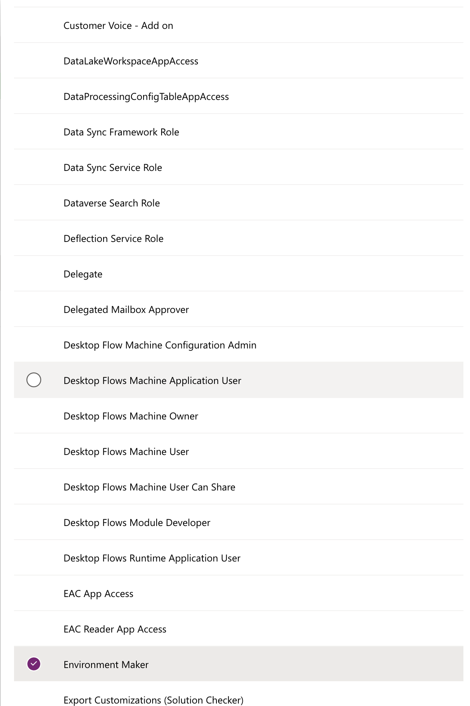

In today's rapidly evolving business landscape, collaboration and data-driven decision-making have become paramount. Microsoft's Power Platform empowers organizations to create custom apps, automate workflows, and derive insights from data, all without requiring extensive coding skills. As businesses strive for greater efficiency and agility, the need to collaborate seamlessly within a secure environment has become crucial. One effective way to achieve this is by sharing Power Platform environments with security groups.

## Sharing Power Platform Environments with Security Groups

Sharing a Power Platform environment with a security group is a strategic approach that streamlines collaboration and enhances security. By associating users with specific security groups, administrators can ensure that the right people have access to the right resources, eliminating the complexities of individual user management. Here's a step-by-step guide to sharing a Power Platform environment with a security group:

### Step 1: Set Up Security Groups

Before sharing your Power Platform environment, establish security groups within your organization's Entra ID (aka Azure Active Directory (AAD)). These groups can be based on roles, departments, projects, or any other relevant criteria. This step ensures that you can easily manage access permissions for a group of users instead of dealing with each user individually.

### Step 2: Access Environment Settings

Within the Power Platform admin center, navigate to the environment you want to share. Open the environment settings, where you'll find the "Access control" section.

### Step 3: Add Security Groups

In the "Access control" section, you'll see an Teams options to add security groups. There click on Create team. 

Select the Team Type "Microsoft Entra Identity Security Group" security group(s) you want to grant access to. This will grant all members of the security group access to the environment without the need for separate invitations.
There you can also select the **Membership type** for the security group. This defines which part of your (Security) Group will get access.
The access levels are:
- Members and guests
- Members
- Owners
- Guests
Fill out the other fields and click on Next.

### Step 4: Manage Security roles

Power Platform provides various access levels, such as System Admin, Environment Maker, etc. Choose the appropriate access level for the security group members based on their responsibilities and requirements.

### Step 5: Save Changes

After configuring the access settings, make sure to save your changes. The security group members will now be able to collaborate within the shared environment based on their assigned access levels.

## Benefits of Sharing with Security Groups

### 1. **Streamlined Collaboration**

By sharing environments with security groups, organizations can optimize their resource allocation. Access to apps, data, and workflows can be controlled at a granular level, ensuring that users only have access to the resources they need. This reduces the risk of unauthorized data access or unintended modifications.

### 3. **Enhanced Security**

Security is a top priority in any digital workspace. Sharing environments with security groups enforces consistent access controls, reducing the chances of data breaches or unauthorized system changes. When a user's role changes or they leave the organization, their access can be easily revoked by adjusting their security group membership.

### 4. **Scalability and Flexibility**

As organizations grow and evolve, their collaboration needs change as well. Sharing with security groups offers scalability and flexibility. New members can be added to security groups, granting them instant access to the appropriate resources. Additionally, security group memberships can be adjusted dynamically to accommodate changing team compositions.

### 5. **Simplified Administration**

Managing permissions for each user individually can be a time-consuming task. Sharing with security groups streamlines administration, as access settings are applied collectively to all group members. This frees up administrators to focus on more strategic tasks.

In conclusion, sharing a Power Platform environment with security groups is a smart strategy for enhancing collaboration, security, and efficiency. By leveraging this approach, organizations can streamline user management, optimize resource allocation, and foster a secure and productive digital workspace. As businesses continue to adapt to the demands of modern work, embracing collaborative solutions like Power Platform and security group sharing is a key step toward success.
