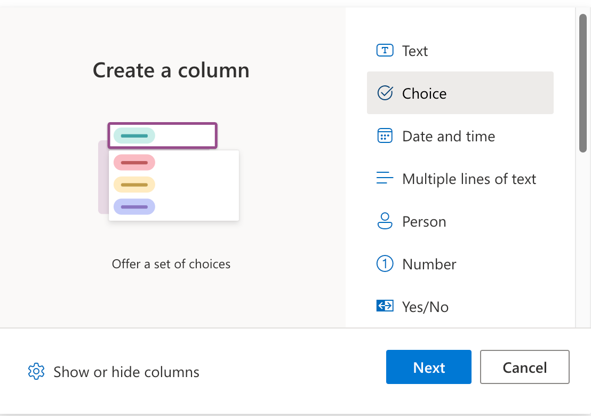
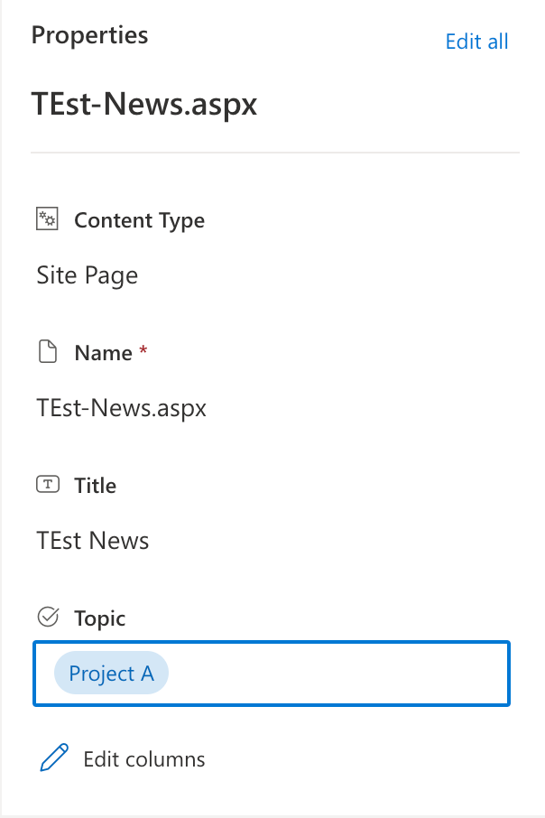
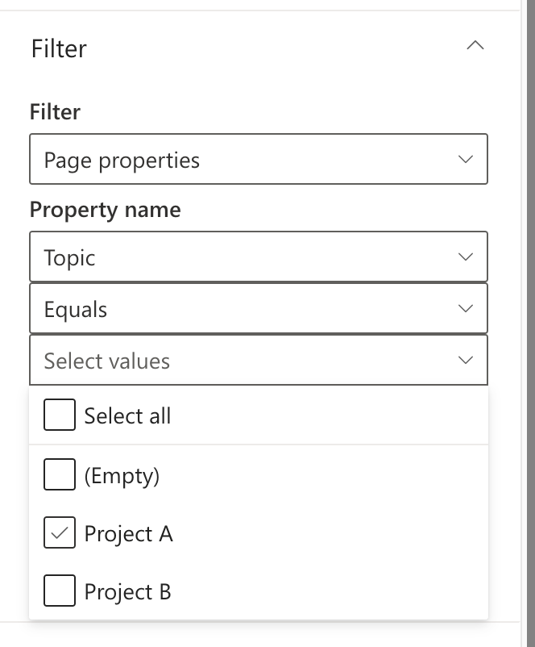

## What Is the SharePoint News Web Part?

Think of the News Web Part as your virtual notice board. It's a digital space in SharePoint where you can pin updates, ideas, and stories. But wait—there's more! This tool is not just for news, it's a versatile platform for all sorts of information sharing.

## Personalizing Your Content Hub

Our journey begins with a unique site that's tailored to show you exactly what you need, whether it's documents, tools, or topics you're passionate about. It's like having a librarian who knows you by name and always recommends the perfect read.

## Labeling Content Made Simple

Here's the secret sauce: 'digital labels' or Metadata. These are like sticky notes that help you sort and find content in a snap. You can label pages with topics such as "Innovation" or "Team Events", making it super easy to organize and retrieve.

## Setting Up Your News Display

Now, let's roll up our sleeves and set up the News Web Part:
1. **Choose your layout**: Pick a style that suits your site. Tiles, carousel, or list—take your pick!
2. **Filter your content**: Decide what you want to see, just like tuning into your favorite radio station.

## Step-by-Step: Crafting Your Digital Labels

### Creating a 'Topic' Column
1. **Head to the Site Pages library**: This is where your content lives.
2. **Add a 'Topic' column**: Name it, choose 'Choice', and list your topics.

3. **Save**: Your labels are ready to go!

### Tagging Your Pages
1. **Edit your page**: Go to the details pane and choose a 'Topic'.

### Filtering News Like a Pro
1. **Edit your page**: Click the pencil icon to edit the page and insert the News Web Part to the page.
1. **Set up your News source**: Choose this site.
1. **Set up your filter**: 
- Go to the filter section and pick 'Page properties' as filter. 
- Choose the 'Topic' column as the property, 
- Check right value(s) (e.g. Project A) and let the magic happen.

## Real-Life Magic

Imagine you have a SiteCollection for your team. You can use different News Web Parts to show News, How-To's, and Events. Each Web Part can be filtered by 'Topic', so everyone sees what's relevant to them.

## Final Thoughts

And there you have it, a friendly guide to making the most of the SharePoint News Web Part. With these tips, your SharePoint site will be the go-to spot for all things relevant and interesting.

